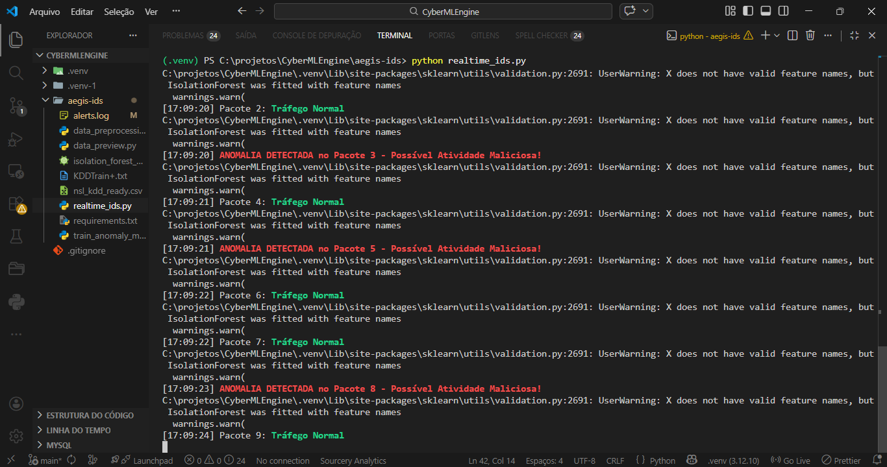

================================================================================
PROJECT: CyberMLEngine - Real-time Network Intrusion Detection
DEVELOPER: Lorena Valeska
STATUS: In Development
================================================================================

[DESCRIPTION]
O CyberMLEngine é um projeto desenvolvido para integrar Inteligência Artificial e Segurança Cibernética. O foco principal é a criação de modelos de Machine Learning capazes de monitorar o tráfego de redes e detectar anomalias ou padrões de intrusão em tempo real. Utilizo Python e bibliotecas como Pandas e Scikit-Learn para o processamento de dados e análise de métricas de segurança

[TECH_STACK]
* Scapy: Captura e analise de pacotes de rede.
* Scikit-Learn: Implementacao do modelo Isolation Forest.
* Pandas & Numpy: Processamento e normalizacao de dados.
* Machine Learning: Algoritmo de deteccao de anomalias (Outliers).

[RESULTS_PREVIEW]

[INSTALLATION_GUIDE]
1. Pre-requisitos:
   Instalar o Npcap (Windows) para captura ativa de pacotes.

2. Setup do Ambiente:
   $ git clone https://github.com/LrnValeska/CyberMLEngine.git
   $ cd aegis-ids
   $ pip install -r requirements.txt

3. Execucao:
   # O terminal deve ser executado como Administrador.
   $ python realtime_ids.py

================================================================================
END_OF_README
